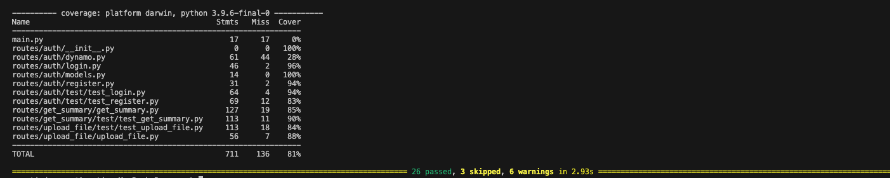

# Stori Technical Challenge

## Overview
A comprehensive system for managing user transactions and generating account summaries. The application allows users to register, authenticate, upload transaction files, and receive email summaries of their account activity.

## System Architecture

URL SOLUTION: https://qyaayv7l7pu7s5y4u7wlbs4dxy0dmmmu.lambda-url.us-east-1.on.aws/docs


### Backend Services

#### User-Facing API (Python/FastAPI)
- **Authentication Service**: Handles user registration and login
- **File Upload Service**: Manages transaction file uploads to S3
- **Summary Service**: Generates and emails account summaries

#### Core Processing (Go)
- **File Processor Lambda**: Processes transaction files from S3 and stores data in DynamoDB
- **Summary Generator Lambda**: Processes user transactions and generates email reports

### AWS Infrastructure
- **API Gateway**: Routes HTTP requests to the FastAPI application
- **Lambda**: Hosts both Python and Go serverless functions
- **ECR (Elastic Container Registry)**: Stores Docker images for Lambda functions
- **DynamoDB**: Stores user data, transactions, and authentication tokens
- **S3**: Stores uploaded transaction files
- **SES**: Handles email delivery for account summaries

## API Usage Examples

### Authentication

#### Register New User
```json
POST /register
Content-Type: application/json

{  
    "email": "john@gmail.com",
    "password": "123456789abc!",
    "name": "John Garcia"
}
```

#### Login
```json
POST /login
Content-Type: application/json

{
    "email": "john@gmail.com",
    "password": "123456789abc!" 
}
```

## File Upload and Processing

### File Upload Endpoint
```http
POST /upload-file
Content-Type: multipart/form-data
```

Parameters:
- `file`: The transaction file (required)
- `folder`: Optional folder path in S3 bucket

### Transaction File Format
The file must follow this specific format:

1. **First Line**: Access token obtained from login
2. **Subsequent Lines**: Transaction data in CSV format

Example:
```
eyJhbGciOiJIUzI1NiIsInR5cCI6IkpXVCJ9.eyJzdWIiOiJqb2huQGdtYWlsLmNvbSJ9.abc123...
user_id,date,amount
123,2024-01-01,100.50
123,2024-01-02,-50.25
```

### Upload Process
1. **Token Verification**:
   - Extracts token from first line
   - Validates token against DynamoDB tokens table
   - Checks token expiration

2. **File Processing**:
   - Removes token line
   - Validates remaining content
   - Uploads to S3 bucket

3. **Response Format**:
```json
{
    "status": "success",
    "message": "File uploaded successfully",
    "file_name": "transactions.csv",
    "s3_path": "folder/transactions.csv"
}
```


### Security Considerations
**Token Validation**:
   - Tokens are verified against DynamoDB
   - Expiration time is checked
   - Invalid tokens result in immediate rejection


#### File Processing Logic (Go Lambda)
The Go Lambda function processes uploaded files with the following steps:

1. **File Detection**: Triggered by S3 events when new files are uploaded
2. **Data Validation**:
   - Validates CSV format (3 columns)
   - Checks date format (YYYY-MM-DD)
   - Validates amount format (numeric)
3. **Transaction Processing**:
   - Generates unique transaction IDs using SHA-256
   - Formats data for DynamoDB storage
   - Handles both credit (positive) and debit (negative) amounts
4. **Error Handling**:
   - Tracks processing statistics
   - Logs errors with detailed messages
   - Continues processing on non-fatal errors
5. **Data Storage**:
   - Saves validated transactions to DynamoDB
   - Includes processing status and metadata

#### Code Example: Transaction Processing
```go
type Transaction struct {
    ID        string    `json:"id"`
    UserID    string    `json:"userId"`
    Date      time.Time `json:"date"`
    Amount    float64   `json:"amount"`
    Processed string    `json:"processed"`
}


## Setup and Deployment

### Prerequisites
- AWS Account with appropriate permissions
- Docker installed
- AWS CLI configured
- Go 1.19+
- Python 3.9+

### Environment Variables
```bash
AWS_REGION=us-east-1
AWS_ACCOUNT=[Your AWS Account ID]
BUCKET_NAME=stori-challenge-bucket
```

### Deployment
Use the provided `upload.sh` script to deploy Lambda functions:

```bash
# Deploy FastAPI Lambda
sh upload.sh fastapi lambda_fastapi app

# Deploy File Processor Lambda
sh upload.sh process_file lambda_process_file core
```

## Database Schema

### Users Table
```
- id (Primary Key)
- email(String)
- password (hashed)
- name(String)
```

### Movements Table
```
- id (Primary Key)
- UserId (String)
- Date (String, Format: YYYY-MM-DD)
- amount (Number)
- processed (String)
```

### Tokens Table
```
- email (Primary Key)
- token (String)
- expiration (String, ISO format)
```

## Monitoring and Logging

### CloudWatch Logs
The Go Lambda function includes comprehensive logging:
```
🚀 Lambda function started
📁 Processing S3 record
📊 Total number of lines found / Final Statistics
✅ Successfully saved transaction
❌ ERROR: [Error details if any]
```

## Development Guide

### Adding New Features
1. Create new route in FastAPI application
2. Update AWS Lambda permissions if needed
3. Add necessary DynamoDB tables/indexes
4. Update deployment scripts
5. Add logging and monitoring

### Testing
- Unit tests for Python components
- Integration tests for AWS services
- API endpoint testing
- File processing validation
- Email delivery verification




### Email reuslt
